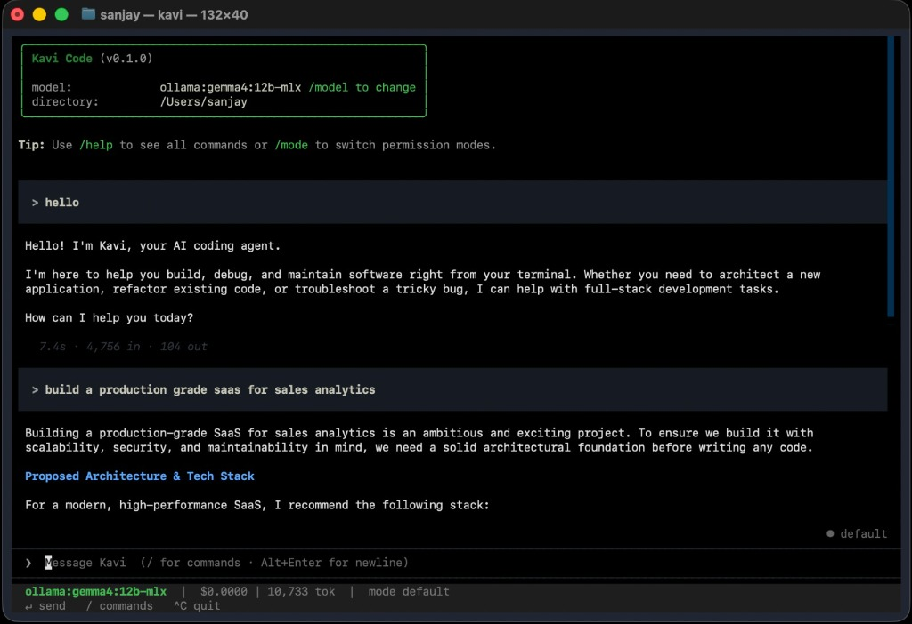

<div align="center">

# ⚡ Kavi Code

**The Production-Grade, Terminal-Native AI Coding Agent**

*Built in Python with [Textual](https://textual.textualize.io/) · Created by Bahumukh AI*

[](https://opensource.org/licenses/MIT)
[](https://www.python.org/downloads/)
[](https://textual.textualize.io/)

<br/>



</div>

---

**Kavi Code** is a local, model-agnostic Python autonomous terminal AI agent built for coding and research workflows. Bring your own API key (Claude, OpenAI, DeepSeek) or run 100% locally with local models via Ollama. Featuring a reactive Textual TUI, Kavi edits codebases safely, browses the web, executes sub-agent tasks, and runs post-edit syntax diagnostics — with an autonomous self-evolving architecture coming soon.

---

## ✨ Features at a Glance

* **🧬 Self-Evolving Architecture (Coming Soon)** — Local-first adaptive memory, procedural skill synthesis, error reflexion loops, and local neuro-symbolic evolution.
* **🖥️ Reactive Terminal UI (TUI)** — Powered by Textual with real-time streaming output, syntax-highlighted tool cards, interactive modal prompts, and responsive command suggestions.
* **🌐 Model Agnostic** — Pluggable multi-provider LLM backend supporting Anthropic (Claude with extended reasoning/thinking), OpenAI, Groq, OpenRouter, DeepSeek, xAI, Fireworks, Cerebras, Mistral, Moonshot, Perplexity, Z.AI, and local models via Ollama.
* **⚡ Self-Correction Diagnostics** — After any file edit or write, Kavi automatically runs background syntax and lint checks (Python `ast`, `ruff`, `pyflakes`, `node`, `tsc`) and feeds errors straight back to the model for instant self-correction.
* **🛡️ Structured Bash Safety & Permission Engine** — Understands command risk (`read`, `exec`, `network`, `destructive`) per pipeline segment. Destructive actions (`rm -rf`, `git push --force`, `del /s /q`, fork bombs) trigger interactive prompts. Supports 4 permission modes (`default`, `auto`, `plan`, `bypass`).
* **🔌 Zero-Config Ecosystem Interoperability** — Automatically imports your existing **Claude Code** (`.mcp.json`, `~/.claude.json`, `.claude/skills`) and **Codex** (`~/.codex/config.toml`) MCP servers, skills, and plugins without re-declaration.
* **🔍 Web Reach & Vision** — Live web search (`WebSearch`), page fetching with Haiku-powered distillation (`WebFetch`), and image inspection (`ViewImage`) for vision-capable models.
* **🧠 Summarizing Context Compaction** — When transcripts fill the context window, stale history is folded into a dense hand-off summary by a fast secondary model while keeping initial goals and recent context verbatim.
* **🎭 Moldable Profiles** — Instantly retarget system prompts and allowed tool sets using built-in profiles (`coding`, `research`, `data`, `devops`) or custom drop-in profiles (`~/.kavi/profiles/`).
* **🧩 Full Extensibility** — Support for progressive-disclosure Skills (`SKILL.md`), lifecycle Hooks (`PreToolUse`, `PostToolUse`, `UserPromptSubmit`, `Stop`), custom Markdown slash commands, and Model Context Protocol (MCP) tools.

---

## 🚀 Quick Start

### Prerequisites
- **Python 3.11+** installed on your system.

### One-Command Remote Installation

**macOS / Linux (Bash)**
```bash
curl -fsSL https://raw.githubusercontent.com/bahumukh/KaviCode/main/scripts/install.sh | bash
```

**Windows (PowerShell)**
```powershell
powershell -ExecutionPolicy Bypass -Command "iwr -useb https://raw.githubusercontent.com/bahumukh/KaviCode/main/scripts/install.ps1 | iex"
```

**Via `pipx` (Any Platform)**
```bash
pipx install git+https://github.com/bahumukh/KaviCode.git
```

*The installer configures an isolated [`pipx`](https://pipx.pypa.io/) installation (putting `kavi` directly on your PATH) or sets up a local `.venv` automatically.*

### Manual / Development Install

```bash
# Clone the repository
git clone https://github.com/bahumukh-ai/kavi.git
cd kavi

# Install in editable mode with development dependencies
python -m venv .venv
# macOS/Linux: source .venv/bin/activate
# Windows:     .venv\Scripts\Activate.ps1
pip install -e ".[dev]"

# Launch Kavi
kavi
```

> **Tip**: Install [`ripgrep`](https://github.com/BurntSushi/ripgrep) (`rg`) for high-speed code search. If unavailable, Kavi seamlessly falls back to an internal pure-Python search scanner.

---

## ⚙️ Configuration & Model Setup

Add API keys at runtime inside the Kavi TUI using the `/apikey` command:

```text
/apikey                       # Interactively select provider & enter key
/apikey groq gsk_...          # Save Groq key, switch provider, & persist config
/apikey openrouter sk-or-...  # Set OpenRouter key
/model                        # List available models for active provider
```

Keys are saved locally in `~/.kavi/config.toml` (or `%APPDATA%\kavi\config.toml` on Windows).

### Environment Variables

You can also pass credentials via standard environment variables:

```bash
export ANTHROPIC_API_KEY=sk-ant-...
export OPENAI_API_KEY=sk-...
export GROQ_API_KEY=gsk_...
export OPENROUTER_API_KEY=sk-or-...
export DEEPSEEK_API_KEY=sk-...
# Ollama requires no key; start with `ollama serve`
```

### Custom `config.toml` Example

Create `~/.kavi/config.toml` or a project-level `.kavi.toml`:

```toml
provider = "anthropic"
model = "claude-sonnet-4-20250514"
thinking = true

# Secondary model for context summaries & web-page distillation
small_fast_model = "claude-3-5-haiku-latest"

# Active profile: coding | research | data | devops
profile = "coding"

# Post-edit syntax validation feedback
post_edit_diagnostics = true

[permissions]
Bash = "ask"
Write = "ask"
Read = "allow"
```

---

## 🛡️ Permission Modes

Switch modes at runtime with `/mode` or set on launch with `--mode`:

| Mode | Read Tools | Edits & Commands | Destructive Actions (`rm -rf`, `git push -f`, ...) |
| :--- | :---: | :---: | :---: |
| **`plan`** | Allowed | Denied | Denied |
| **`default`** | Allowed | Interactive Prompt | Interactive Prompt |
| **`auto`** | Allowed | Auto-Accepted | Interactive Prompt |
| **`bypass`** | Allowed | Auto-Accepted | Auto-Accepted |

* `auto` mode is ideal for fast coding—applying edits seamlessly while still guarding against destructive shell actions.
* `plan` mode locks the agent into a safe, read-only analysis persona.

---

## 💻 CLI Usage & Commands

```bash
kavi                    # Start an interactive TUI session
kavi --resume           # Select and resume a past session
kavi -p "Fix the bug"   # Run a one-shot task (headless)
kavi --mode auto        # Launch directly in auto-accept mode
kavi --profile research # Launch with research persona & tools
```

### Built-In Slash Commands

In the interactive TUI, type `/` to access rich commands:
- `/apikey` — Manage provider API credentials.
- `/model` — Select models dynamically.
- `/mode` — Switch permission modes (`plan`, `default`, `auto`, `bypass`).
- `/profile` — Switch agent profiles (`coding`, `research`, `data`, `devops`).
- `/mcp` — Inspect connected Model Context Protocol servers and tools.
- `/skills` — List loaded on-demand skills.
- `/hooks` — View active lifecycle hook scripts.
- `/plugins` — Manage installed plugins.
- `/cost` — Monitor token consumption and session USD expenditure.
- `/resume` — Pick a past session to restore.
- `/doctor` — Run environment & tool dependency diagnostics.

---

## 🔌 Extensibility & Plugin Architecture

Kavi automatically scans `.kavi/` directories (and inherits `.claude/` / `~/.codex/` setups):

```text
<workspace>/.kavi/ (or ~/.kavi/)
├── commands/          # Custom slash commands (e.g. git/commit.md -> /git:commit)
├── skills/<name>/SKILL.md   # Progressive-disclosure expert instructions
├── hooks.json         # Shell hooks (PreToolUse, PostToolUse, UserPromptSubmit, Stop)
└── profiles/<name>.md # Custom persona & tool-set configurations
~/.kavi/plugins/<name>/# Bundled plugin extensions
KAVI.md                # Hierarchical project memory auto-injected into prompts
```

---

## 🏗️ Architecture Overview

```text
               +----------------------------------+
               |        Textual TUI / CLI         |
               +----------------------------------+
                                |
                                v
               +----------------------------------+
               |           Agent Engine           |
               +----------------------------------+
                  /             |              \
                 v              v               v
    +-------------------+ +------------+ +--------------------+
    | Context Compactor | | Permission | | Post-Edit Syntax   |
    | & Memory Manager  | | Engine     | | Diagnostics Filter |
    +-------------------+ +------------+ +--------------------+
                 |              |               |
                 v              v               v
    +---------------------------------------------------------+
    |     Tool Registry (File, Bash, Web, MCP, Sub-Agents)   |
    +---------------------------------------------------------+
                                |
                                v
    +---------------------------------------------------------+
    |     LLM Provider Adapters (Anthropic, OpenAI, Ollama)   |
    +---------------------------------------------------------+
```

---

## 🤝 Contributing

Contributions are welcome! Please feel free to submit issues, feature requests, or pull requests.

1. Fork the Repository
2. Create a Feature Branch (`git checkout -b feature/amazing-feature`)
3. Commit your changes (`git commit -m 'Add amazing feature'`)
4. Run tests: `pytest`
5. Push to the branch (`git push origin feature/amazing-feature`)
6. Open a Pull Request

---

## 📄 License

Distributed under the **MIT License**. See [`LICENSE`](LICENSE) for details.
